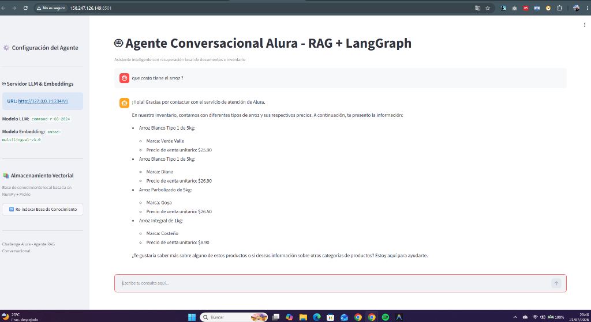

# 🤖 Agente RAG Conversacional - Challenge Alura

[](https://www.python.org/)
[](https://www.langchain.com/)
[](https://streamlit.io/)
[-red.svg)](https://cloud.oracle.com/)
[](https://trello.com/b/VW6bR5kG/challenge-1-alura)
[](https://docs.astral.sh/uv/)

---

## 📋 Descripción General del Proyecto

El **Agente RAG Conversacional - Challenge Alura** es un sistema asistencial e interactivo desarrollado para optimizar la atención al cliente y la consulta de inventarios en **Alura Supermercados**. 

Integrando técnicas de **Generación Aumentada por Recuperación (RAG)** y orquestación de agentes mediante **LangGraph**, la solución es capaz de responder preguntas complejas sobre políticas de servicio, devoluciones, procedimientos internos y disponibilidad/precios de productos en tiempo real a partir de fuentes documentales heterogéneas (PDFs y hojas de cálculo Excel).

### 🎯 Objetivos Principales
* **Recuperación Semántica Precisa:** Ingesta y consulta eficiente de información en documentos no estructurados (PDF) y datos estructurados (Excel).
* **Enrutamiento Inteligente de Intenciones:** Clasificación automática de mensajes para diferenciar consultas documentales de diálogos conversacionales directos.
* **Resiliencia e Independencia Tecnológica:** Soporte multi-proveedor (Local con LM Studio, Cloud con Cohere API / OpenAI) y motor vectorial en memoria sin dependencias binarias rígidas.
* **Experiencia de Usuario Fluidas:** Interfaz web interactiva con transmisión de respuestas en tiempo real (Streaming token a token).

---

## 📸 Demostración de Funcionamiento

A continuación se muestra la interfaz web interactiva en ejecución, procesando una consulta en tiempo real sobre la disponibilidad y precios del arroz en el inventario:



> [!NOTE]
> En la captura se observa el funcionamiento del flujo RAG en la Web UI: el usuario realiza la consulta `¿que costo tiene el arroz ?` y el agente recupera los registros del inventario local (`NumPy + Pickle`), formateando una respuesta detallada por tipos de arroz, marcas y precios unitarios.

---

## 🌐 Despliegue en la Nube (OCI) y Acceso en Vivo

La solución se encuentra **desplegada y operativa** en una máquina virtual en la nube a través de **Oracle Cloud Infrastructure (OCI)**.

* 🔗 **Acceso Público a la Web UI (Frontend):** [http://158.247.126.149:8501](http://158.247.126.149:8501)
* 📌 **Tablero de Gestión del Proyecto (Trello):** [Challenge 1 Alura - Trello Board](https://trello.com/b/VW6bR5kG/challenge-1-alura)

### Detalles de la Infraestructura OCI
* **Instancia:** Compute Instance Ubuntu 22.04 LTS (Arquitectura Ampere A1 ARM64 - OCI Always Free Tier).
* **Configuración de Red:** Reglas de entrada (`Ingress Rules`) en la VCN de OCI y políticas de firewall (`iptables`) habilitadas en el puerto `8501`.
* **Ejecución Persistente:** Servidor Streamlit configurado con permisos de acceso remoto continuo, sin restricciones CORS/XSRF.

---

## 🛠️ Tecnologías y Herramientas Utilizadas

| Categoría | Tecnología / Herramienta | Descripción / Uso |
| :--- | :--- | :--- |
| **Lenguaje Core** | **Python 3.14+** | Lenguaje principal de desarrollo. |
| **Orquestación de Agente** | **LangGraph** | Grafo de estado autónomo para gestión de ciclos de decisión y enrutamiento. |
| **Framework RAG** | **LangChain Core** | Abstracción de cadenas, prompts y conectores de modelos. |
| **Modelos LLM** | **Cohere API / LM Studio / OpenAI** | Generación de respuestas (`command-r-08-2024` / local). |
| **Modelos de Embeddings** | **Cohere Embeddings / LM Studio** | Vectorización semántica multilíngüe (`embed-multilingual-v3.0`). |
| **Vector Store Local** | **NumPy + Pickle** | Almacenamiento vectorial en memoria con búsqueda por Similitud de Coseno sin dependencias binarias C++. |
| **Interfaz de Usuario (UI)** | **Streamlit** | UI web receptiva con streaming de respuestas token por token. |
| **Procesamiento de Docs** | **PyPDF & Pandas / OpenPyXL** | Lectura y fragmentación de PDFs y estructuración clave-valor de Excels. |
| **Gestión de Entorno** | **uv (Astral)** | Gestor ultra rápido de paquetes, entornos virtuales y dependencias. |
| **Infraestructura Cloud** | **Oracle Cloud Infrastructure** | Despliegue cloud continuo en VM Ubuntu ARM64. |
| **Gestión de Proyecto** | **Trello** | Seguimiento de historias de usuario, tareas y avances del sprint. |

---

## 🏗️ Arquitectura de la Solución

El sistema sigue una arquitectura orientada a grafos de estado (**StateGraph**) con enrutamiento dinámico de intenciones.

```text
                                +-------------------------+
                                |     Usuario (UI/CLI)    |
                                +------------+------------+
                                             |
                                             v
                                +------------+------------+
                                |     Intent Router       |
                                | (Clasificador de flujo) |
                                +-----+---------------+---+
                                      |               |
                     [Pregunta sobre datos]     [Saludo / Conversación]
                                      |               |
                                      v               |
                          +-----------+-----------+   |
                          |     Retrieve Node     |   |
                          | (NumPy LocalVectorStore|  |
                          +-----------+-----------+   |
                                      |               |
                                      +-------+-------+
                                              |
                                              v
                                  +-----------+-----------+
                                  |     Generate Node     |
                                  | (Cohere / LM Studio)  |
                                  +-----------------------+
```

### Arquitectura Modular: Patrón SIDE

Para mantener un código limpio, extensible y mantenible, la lógica del agente en `src/agents/rag_support/` se organizó bajo el patrón **SIDE**:

* **`[S]`tate (`state.py`)**: Define el esquema centralizado del estado del agente (`AgentState`).
* **`[I]`nstructions (`system_prompt.py`)**: Contiene las directivas del sistema, personalidad del agente y plantillas de prompts contextuales.
* **`[D]`ecisions (`edges/`)**: Lógica de enrutamiento condicional (`intent_router.py`) para bifurcar el flujo según el contenido de la consulta.
* **`[E]`xecution (`nodes/`)**: Nodos de ejecución pura para la recuperación de contexto (`retrieve.py`) y generación de la respuesta final (`generate.py`).

---

## 💡 Ejemplos de Preguntas que el Agente Puede Responder

El agente está capacitado para atender diversas áreas de consulta del negocio:

### 🛒 Inventario y Productos
* `¿Qué costo tiene el arroz?`
* `¿Tienen stock de aceite de oliva y de qué marca?`
* `¿Qué variedades de café hay disponibles y cuáles son sus precios?`
* `¿Tienen leche deslactosada en inventario?`

### 📜 Políticas y Atención al Cliente
* `¿Cuál es la política de devoluciones y cambios de la tienda?`
* `¿Qué plazo tengo para solicitar el reembolso de un producto en mal estado?`
* `¿Cuáles son los canales y horarios de atención al cliente?`
* `¿Qué requisitos se necesitan para hacer un reclamo por un producto no entregado?`

### 🚚 Envíos y Medios de Pago
* `¿Cuáles son los métodos de pago aceptados en la tienda?`
* `¿Hacen envíos a domicilio y cuánto tarda en llegar el pedido?`

### 🤝 Proveedores y Procedimientos Operativos
* `¿Cuáles son los requisitos indispensables para registrarse como proveedor de Alura?`
* `¿Cómo es el proceso de recepción de mercancía y facturación electrónica?`

---

## 💬 Ejemplos de Respuestas Generadas por el Agente

A continuación se ilustran ejemplos reales de la interacción entre los usuarios y el agente:

### Ejemplo 1: Consulta de Inventario y Precios
**Usuario:** `¿que costo tiene el arroz ?`

**Agente:**
> ¡Hola! Gracias por contactar con el servicio de atención de Alura.
> 
> En nuestro inventario, contamos con diferentes tipos de arroz y sus respectivos precios. A continuación, te presento la información:
> 
> * **Arroz Blanco Tipo 1 de 5kg:**
>   * **Marca:** Verde Valle
>   * **Precio de venta unitario:** $25.90
> * **Arroz Blanco Tipo 1 de 5kg:**
>   * **Marca:** Diana
>   * **Precio de venta unitario:** $26.90
> * **Arroz Parbolizado de 5kg:**
>   * **Marca:** Goya
>   * **Precio de venta unitario:** $26.50
> * **Arroz Integral de 1kg:**
>   * **Marca:** Costeño
>   * **Precio de venta unitario:** $8.90
> 
> ¿Te gustaría saber más sobre alguno de estos productos o si deseas información sobre otras categorías de productos? Estoy aquí para ayudarte.

---

### Ejemplo 2: Consulta sobre Políticas de Devolución
**Usuario:** `¿Cuál es el tiempo límite para devolver un producto comprado en la tienda?`

**Agente:**
> ¡Hola! Con gusto te informo sobre nuestra política de devoluciones:
> 
> Según la **Política de Atención al Cliente de Alura Supermercados**:
> * Para **productos no perecederos**, cuentas con hasta **30 días calendario** a partir de la fecha de emisión del comprobante de compra.
> * Para **productos perecederos o frescos**, el reporte debe realizarse dentro de las primeras **24 horas** de haber recibido la compra.
> 
> Para procesar tu devolución, es indispensable presentar el ticket o factura de compra original y que el producto conserve su empaque primario.

---

### Ejemplo 3: Consulta sobre Proveedores
**Usuario:** `¿Qué requisitos debo cumplir para ser proveedor de Alura?`

**Agente:**
> De acuerdo con el **Manual de Proveedores y Política de Compras de Alura**, los requisitos principales para homologarse como proveedor son:
> 
> 1. Estar legalmente constituido y contar con Registro Tributario activo.
> 2. Presentar certificaciones sanitarias y fichas técnicas de los productos ofrecidos.
> 3. Operar con el sistema de Facturación Electrónica.
> 4. Aceptar los términos de pago estándar (30 a 60 días según la categoría).

---

## 🚀 Instrucciones para Ejecutar el Proyecto

### 1. Clonar el Repositorio e Ingresar al Directorio

```bash
git clone https://github.com/narvaezdario91/challenge-alura-agent.git
cd challenge-alura-agent
```

### 2. Configurar Variables de Entorno

Crea un archivo `.env` en la raíz del proyecto basándote en el plantilla `.env.example`:

```ini
# Configuración del Servidor LLM & Embeddings (Providers: lm_studio | openai | cohere)
LLM_PROVIDER=cohere
LLM_BASE_URL=http://127.0.0.1:1234/v1

# Modelos para Cohere API (o nombres correspondientes a tu proveedor)
LLM_MODEL_NAME=command-r-08-2024
EMBEDDING_MODEL_NAME=embed-multilingual-v3.0

# Claves de API
LLM_API_KEY=lm-studio
COHERE_API_KEY=tu_cohere_api_key_aqui

LLM_TEMPERATURE=0.1
LLM_STREAMING=true

# Parámetros RAG
KNOWLEDGE_BASE_DIR=knowledge_base
CHUNK_SIZE=800
CHUNK_OVERLAP=150
```

### 3. Sincronizar el Entorno de Dependencias con `uv`

Este proyecto utiliza **`uv`** para la gestión de dependencias:

```bash
uv sync
```

### 4. Iniciar la Aplicación Web (Streamlit UI)

Para abrir la interfaz interactiva en tu navegador predeterminado:

```bash
uv run streamlit run app.py
```

La aplicación estará disponible localmente en `http://localhost:8501`.

### 5. Iniciar la Interfaz de Consola (CLI)

Si prefieres interactuar con el agente desde la terminal:

```bash
uv run python main.py
```

### 6. Re-indexar la Base de Conocimiento (Opcional)

Si agregas nuevos documentos PDF o archivos Excel a la carpeta `knowledge_base/`, puedes re-generar el almacén vectorial en cualquier momento:

```bash
uv run python main.py --reindex
```

---

## 📁 Estructura del Proyecto

```text
challenge-alura-agent/
├── assets/                 # Imágenes y capturas de pantalla para documentación
│   └── demo_agent.png
├── knowledge_base/         # Base de conocimiento (PDFs de políticas y Excel de inventario)
├── src/
│   ├── config/             # Configuración centralizada con Pydantic Settings
│   │   └── settings.py
│   ├── shared/             # Módulos compartidos y clientes de modelos
│   │   ├── ingestion.py    # Ingesta y parseo de PDF/Excel
│   │   ├── llm_factory.py  # Fábrica de clientes (LM Studio / OpenAI / Cohere)
│   │   ├── patch_xxhash.py # Parche de compatibilidad Windows DLL
│   │   └── vector_store.py # LocalVectorStore (NumPy + Pickle + Batching)
│   ├── ui/                 # Componentes modulares de Streamlit Web UI
│   │   ├── state.py        # Estado conversacional de Streamlit y grafo
│   │   └── components/
│   │       ├── sidebar.py  # Panel de configuración y control de re-indexación
│   │       └── chat.py     # Componente de chat con streaming de tokens
│   └── agents/
│       └── rag_support/    # Implementación del Agente RAG en LangGraph (Patrón SIDE)
│           ├── agent.py    # Construcción y compilación del StateGraph
│           ├── state.py    # Definición de AgentState
│           ├── system_prompt.py # Prompts y personalidad del asistente
│           ├── edges/      # Enrutadores condicionales (intent_router.py)
│           └── nodes/      # Nodos de ejecución (retrieve.py, generate.py)
├── app.py                  # Punto de entrada principal para Streamlit Web UI
├── main.py                 # Punto de entrada para consola CLI
├── pyproject.toml          # Configuración de dependencias UV
└── README.md               # Documentación general del proyecto
```

---

## 🤝 Créditos y Reconocimientos

Desarrollado como parte del **Challenge Alura - Agente Conversacional RAG**, combinando las mejores prácticas de la arquitectura de agentes inteligentes con **LangGraph** y tecnologías modernas del ecosistema Python.
